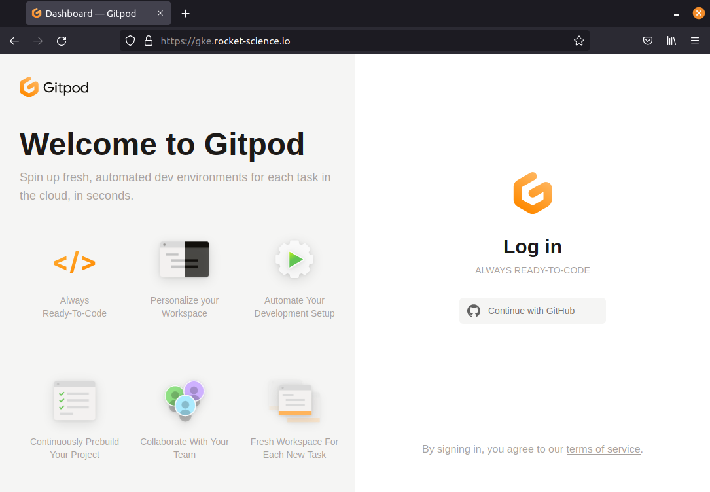

# Running Gitpod in [k3s](https://k3s.io)

Before starting the installation process, you need:

- An Ubuntu machine with SSH credentials
  - This must have ports 22 (SSH), 80 (HTTP), 443 (HTTPS) and 6443 (Kubernetes) exposed
- A `.env` file with basic details about the environment.
  - We provide an example of such file [here](.env.example)
- A [Cloudflare](https://cloudflare.com) account with your domain name configured
- [Docker](https://docs.docker.com/engine/install) installed on your machine, or better, a [Gitpod workspace](https://github.com/MrSimonEmms/gitpod-k3s-guide) :)

This has been tested on bare-metal Ubuntu and [Multipass](https://multipass.run).

**To start the installation, execute:**

```shell
./setup.sh install
```

This process takes about 5 minutes. In the end, the following resources are configured:
  - Certificate created for `$DOMAIN`, `*.$DOMAIN` and `*.ws.$DOMAIN`
  - [gitpod.io](https://github.com/gitpod-io/gitpod) deployment running in-cluster dependencies

As k3s tends to use the internal IP address, you will need to manually configure A records for:
 - `$DOMAIN`
 - `*.$DOMAIN`
 - `*.ws.$DOMAIN`

### Troubleshooting

- Pods running out of resources

  This is a single-instance cluster. You will need to either add additional nodes or use a machine with greater resources.
  The seggested size is 4vCPUs and RAM in excess of 16GB. Disk size should also break a minimum of 100GB.

- Some pods never start (`Init` state)

  ```shell
  kubectl get pods -l component=proxy
  NAME                     READY   STATUS    RESTARTS   AGE
  proxy-5998488f4c-t8vkh   0/1     Init 0/1  0          5m
  ```

  The most likely reason is because the [DNS01 challenge](https://cert-manager.io/docs/configuration/acme/dns01/) has yet to resolve. If using `MANAGED_DNS_PROVIDER`, you will need to update your DNS records to the IP of your machine.

  Once the DNS record has been updated, you will need to delete all Cert Manager pods to retrigger the certificate request

  ```shell
  kubectl delete pods -n cert-manager --all
  ```

  After a few minutes, you should see the `https-certificate` become ready.

  ```shell
  kubectl get certificate
  NAME                        READY   SECRET                      AGE
  https-certificates          True    https-certificates          5m

## Verify the installation

First, check that Gitpod components are running.

```shell
kubectl get pods
NAME                                      READY   STATUS    RESTARTS   AGE
agent-smith-bvh85                         2/2     Running   0          28m
blobserve-55d9686f79-49725                2/2     Running   0          28m
content-service-6c8648dbc4-92hkc          1/1     Running   0          28m
dashboard-d9676479d-cvxnz                 1/1     Running   0          28m
ide-proxy-58fb9c94d6-g2fbd                1/1     Running   0          28m
image-builder-mk3-d7dd7844-snpzd          2/2     Running   0          28m
jaeger-operator-76f4bc6f6f-x7sh9          1/1     Running   0          28m
messagebus-0                              1/1     Running   0          28m
minio-5fc44cd4c-gvn44                     1/1     Running   0          28m
mysql-0                                   1/1     Running   0          28m
openvsx-proxy-0                           1/1     Running   0          28m
proxy-599bf9965c-fwmhq                    2/2     Running   0          28m
registry-6d66b86676-6z98j                 1/1     Running   0          28m
registry-facade-6bt4n                     2/2     Running   0          28m
server-7bdbb5f7fd-pqgrv                   2/2     Running   0          28m
svclb-proxy-vgrj5                         3/3     Running   0          28m
ws-699124a7-db88-4973-9e2a-5d0d360faa86   1/1     Running   0          6m28s
ws-daemon-lcdpm                           2/2     Running   0          28m
ws-manager-65b8d9f5f5-hrrvb               1/1     Running   0          28m
ws-manager-bridge-769fcc8688-7f89r        2/2     Running   0          28m
ws-proxy-57965559-z5lcb                   1/1     Running   0          28m
ws-scheduler-5d848f9f4f-7fm9s             2/2     Running   0          28m
```

### Test Gitpod workspaces

When the provisioning and configuration of the cluster is done, the script shows the URL of the load balancer,
like:

Please open the URL `https://<domain>/workspaces`.
It should display the Gitpod login page similar to the next image.

*DNS propagation* can take several minutes.



----

## Destroy the resources

Remove k3s from your machine by running:

```shell
./setup.sh uninstall
```
